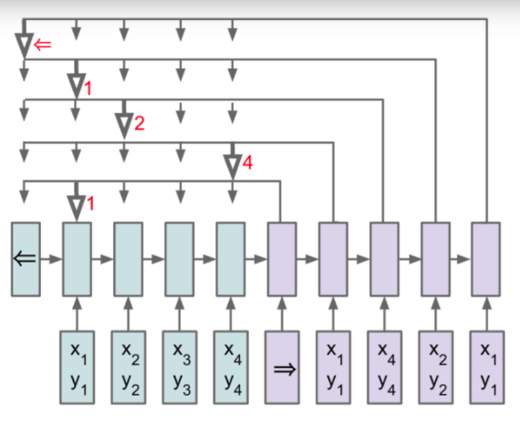
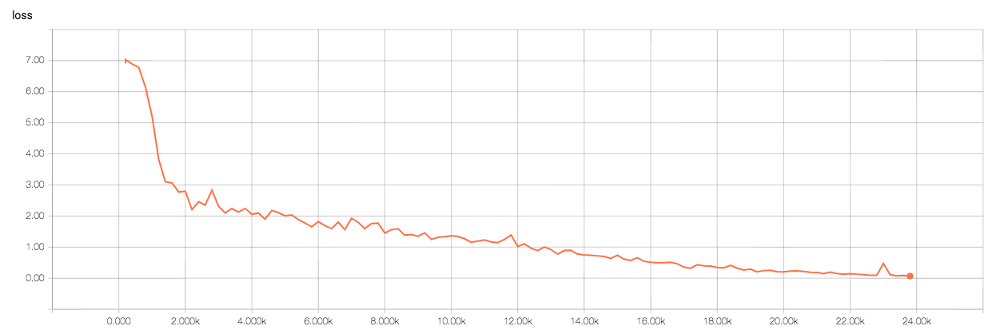
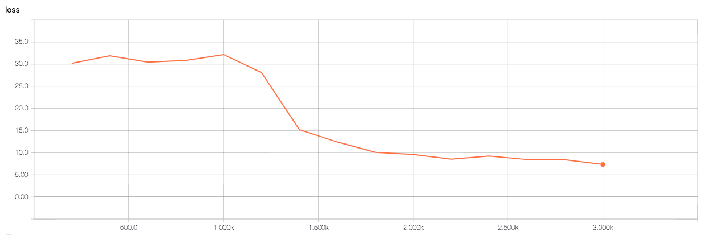

# Pointer Networks in Tensorflow

This is an implementation of [Pointer Networks](https://arxiv.org/abs/1506.03134) to solve the [Convex Hull](https://en.wikipedia.org/wiki/Convex_hull) problem. Stacking RNN layers is supported.

## Environments

* Python 3.x
* TensorFlow 1.2.x

## Data

Convex Hull datasets such as  "convex hull 5" and "convex hull 5-50"  can be downloaded at [Link](https://drive.google.com/drive/folders/0B2fg8yPGn2TCMzBtS0o4Q2RJaEU).

## Usage

training

$ python convex_hull.py --ARG=VALUE

evaluating

$ python convex_hull.py --forward_only=True --beam_width=VALUE --ARG=VALUE

visualizing

$ tensorboard --logdir=DIR

## Results

Training on convex hull 5

Training on convex hull 5-50

